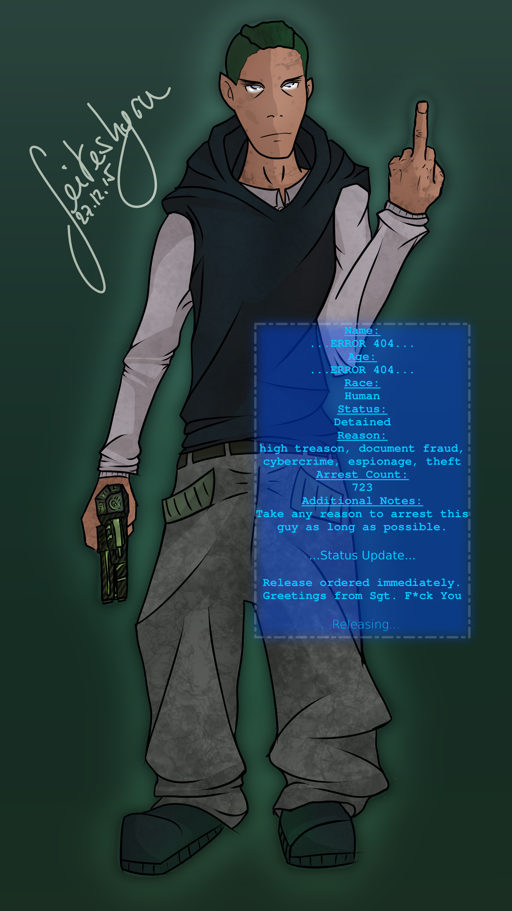

# Short

# Ideas
Social Justice, Sozialprobleme, Ansätze eines Faces - allerdings kein Soziales Gefühl, Pazifist (Will mit Mord einfach nichts am Hut haben), "Jeder Mensch verbirgt ein dunkles Geheimnis", Drogenproblem

# Creation
Prioritätensystem  
A Fertigkeiten 46/10
B Attribute 20
C Mensch (5)  
D Geld 140.000 Y
E Magie -  

## Attribute
KON 1/6 **2/6**  
GES 1/6 **2/6**  
REA 1/6 **2/6**  
STR 1/6 **2/6**  
WIL 1/6 **5/6**  
LOG 1/6 **5/6**  
INT 1/6 **5/6**  
CHA 1/6 **5/6**  
EDG 2/7 **7/7**  
ESS 6  

## Fertigkeiten
Wahrnehmung 5 **10** (Optisch)  
Schleichen 5 **7** (Gebäudeinneres)  
Überreden 5 **10** (Überzeugen)  
Gebräuche 5 **10** (Sicherheitsetikette)  
Schlosser 5 **7** (Magschlösser)  
Fälschen 5 **10**  
Verkörperung 5 **10**  
Einschüchterung 5 **10**  

Computer 5 **10** (Datensuche)  
Software 5 **10**  
Hardware 5 **10**  

Elektronische Kriegsführung 5 **10**  
Hacking 5 **10**  
Matrixkampf 5 **10**  

### Wissensfertigkeiten
(INT+CHA)x2 = 20  
English M  
Matrixsicherheit 5 **10**  
Matrixdesign 5 **10**  
Konzerne 5 **10**  
Social Engineering 5 **10**  

## Vor- und Nachteile
25 Karma + 22 Karma - 8 Karma = 39 Karma  
### Vorteile
3 Gesunder Menschenverstand  
5 Übertakter  
### Nachteile
4 Leichte Abhängigkeit Novacoke  
9 Mittlere Abhängigkeit Long Haul  
2 Getrieben Sturz des Systems  
7 Paranoima  

## Ausrüstung
140.000 + 20.000 Y (10 Karma) = 160.000 Y  

 5.000 Y 0.4 Essenz 5E Cyberdeckimplantat  
10.000 Y 0.4 Essenz 9 Cyberaugen Stufe 3 Kapazität 12  
  1.500 Y [2] 4 Infrarotsicht  
  1.500 Y [2] 4 Restlichtverstärkung  
  4.000 Y [3] 8E Smartlink  
  2.000 Y [2] 4 Sichtvergrößerung  
 12.000 Y [3] 9 Sichtverbesserung Stufe 3  
13.500 Y 0.25 Essenz 9 Interner Lufttank Stufe 3  
 7.500 Y 0.2 Essenz 6 Schmuggelbehälter  
 3.500 Y 0.5 Essenz 12E Cyberimplantat Automatikpistole  
  Smartgunsystem, (Lasermarkierer und Schalldämpfer möglich)  
12.000 Y 0.1 Essenz 6 Schlafregulator  

 5.000 Y Doc Wagon Standard  
 3.000 Y 8E Automatischer Dietrisch Stufe 6  
   250 Y 4E Dietrich-Set  
10.000 Y Gefälschte SIN Stufe 4  

58.000 Y 3E Microdeck Summit Gst. 1 4-3-3-1 1 Programm  
 5.000 Y 12 Transys Avalon  

 1.500 Y 8 Actioneer Geschäftskleidung Panzerung 8
